# Project 2: Gradient Boosting Trees

---

## Table of Contents

1. [Introduction](#introduction)
2. [Overview](#overview)
3. [How the Model Works](#how-the-model-works)
4. [Getting Started](#getting-started)
5. [Test Coverage](#test-coverage)
6. [Summary of Test Scenarios](#summary-of-test-scenarios)
7. [Visual Output Samples](#visual-output-samples)
8. [Adjustable Parameters](#adjustable-parameters)
9. [Basic Usage Example](#basic-usage-example)
10. [Limitations & Future Work](#limitations--future-work)
11. [Q&A](#qa)
12. [Team Members](#team-members)

---

## Introduction

This repository presents a from-scratch implementation of a **Gradient Boosting Classifier**, based on logistic loss minimization via additive tree models. Inspired by Sections 10.9–10.10 of *The Elements of Statistical Learning*, this model builds gradient boosting trees step-by-step for classification.

---

## Overview

The model was designed to classify binary outcomes using iterative refinement through weak learners (shallow trees). This repo includes:

- A full gradient boosting classifier
- Utilities for metric calculations and visualization
- Data generation for synthetic datasets
- Evaluation on real-world (IBM Attrition) and synthetic datasets

---

## How the Model Works

1. Start with a constant prediction (log-odds of class 1).
2. Compute the negative gradient of the logistic loss.
3. Train a regression tree on this gradient.
4. Add this new model to the ensemble.
5. Repeat for a fixed number of boosting rounds (`n_estimators`).

Each decision tree splits based on variance reduction (as a proxy for classification gain), and outputs a real-valued score added to the logits.

---

## Getting Started

### 1. Clone the repository

```bash
git clone https://github.com/Nupur-Gudigar/Project2.git
cd Project2/Boosting Trees
```

### 2. Install dependencies

```bash
pip install -r requirements.txt
```

### 3. Run the model

```bash
python tests/test_BoostingTrees.py
```

### 4. Generate synthetic datasets (optional)

```bash
python generate_data.py
```

---

## Test Coverage

This repo includes tests using both real-world and synthetic data.

### Included datasets:

-  `ibm_attrition.csv`
-  `classification_data.csv`
-  `circle_classification_data.csv`
-  `moon_classification_data.csv`

Each dataset helps validate model behavior on linearly separable, non-linear, and imbalanced cases.

---

## Summary of Test Scenarios

| Test Scenario          | Dataset                   | Description                                    |
|------------------------|---------------------------|------------------------------------------------|
| Real-world data        | `ibm_attrition.csv`       | HR Attrition classifier using actual company data |
| Synthetic circle data  | `circle_classification_data.csv` | Non-linear separation test                      |
| Synthetic moon data    | `moon_classification_data.csv`   | Interleaved half-moons pattern                 |
| Manual split strategy  | Balanced class training   | Ensures classes appear in train/test properly |
| Visual confirmation    | All datasets              | Saves confusion matrices, ROC curves, histograms, learning curves |

---

## Visual Output Samples

After successful model run, these are generated automatically under `notebooks/images/`:

-  **Confusion Matrix**: Shows actual vs predicted labels
-  **ROC Curve**: True positive rate vs false positive rate
-  **Learning Curve**: Accuracy vs number of estimators
-  **Probability Histogram**: Distribution of model confidence
-  **Decision Boundary**: Visualizes model decision regions (2D data only)

---

---
## Output and Visualizations

This project includes a `GradientBoosting_Visualization.ipynb` notebook to visualize model behavior across different datasets, performance metrics, and predictions.

---

### 1. Decision Boundary Plots

These plots show how the model separates classes for 2D datasets using color-coded regions.

**Applicable Datasets:**

- `moon_classification_data.csv`
- `circle_classification_data.csv`

####  Moon Dataset  
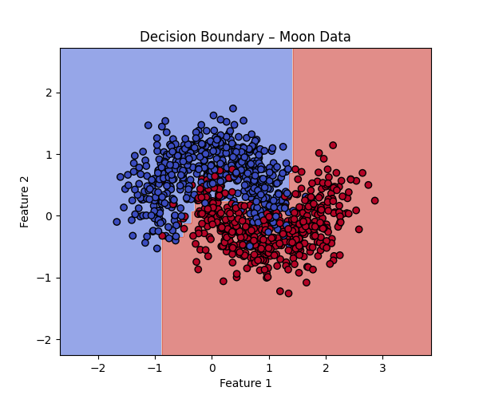

####  Circle Dataset  
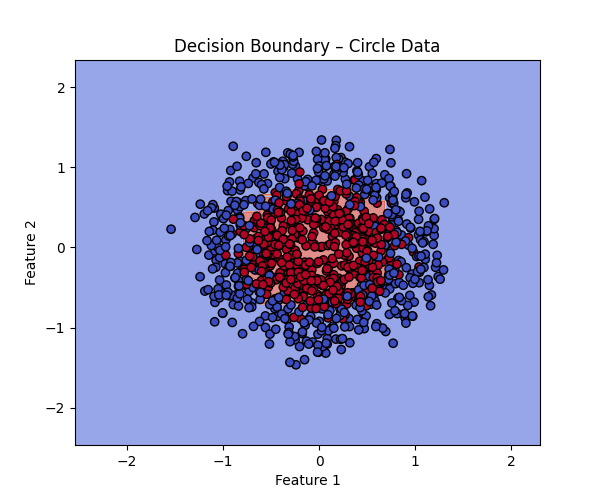

---

### 2. Confusion Matrix Heatmaps

Summarizes correct and incorrect predictions for each class.

####  IBM Attrition  
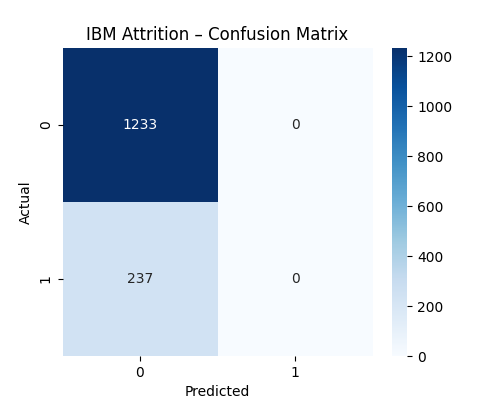

####  Classification Dataset  
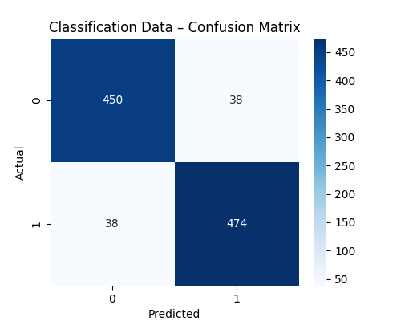

####  Moon Dataset  
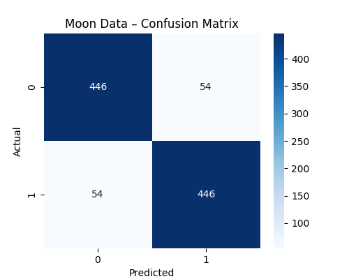

####  Circle Dataset  
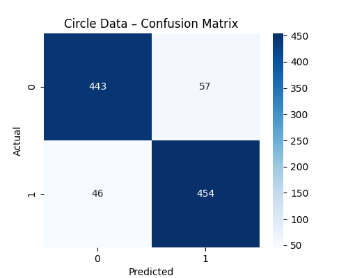

---

### 3. ROC Curve

Plots the True Positive Rate vs False Positive Rate to measure classifier performance.

####  IBM Attrition  
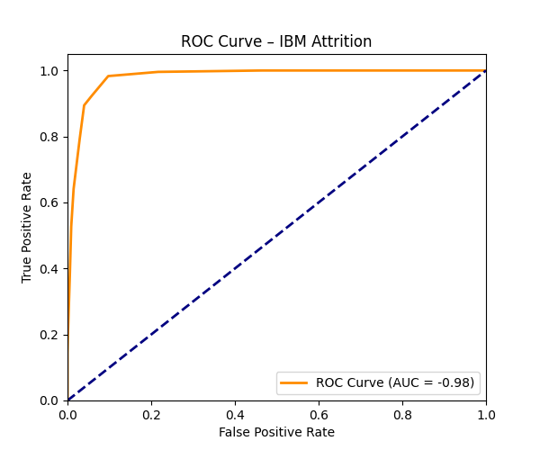

####  Classification Dataset  
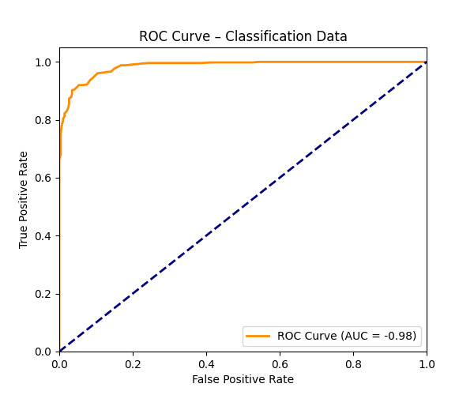

####  Moon Dataset  
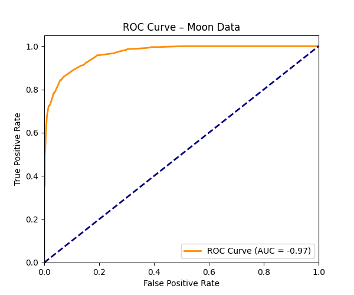

####  Circle Dataset  


---

### 4. Probability Histogram

Shows the distribution of predicted probabilities for class 1.

####  Moon Dataset  
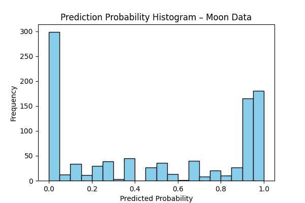

####  Circle Dataset  
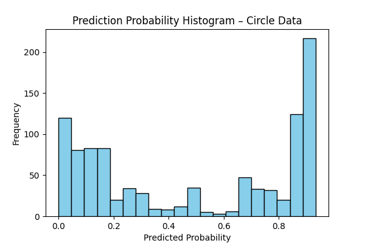

####  Classification Dataset  
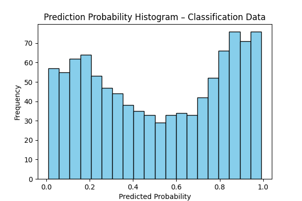

####  IBM Attrition  
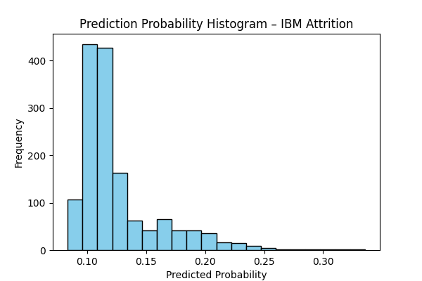

---

### 5. Learning Curve

Displays the model's accuracy across boosting rounds to analyze convergence.

####  Moon Dataset  
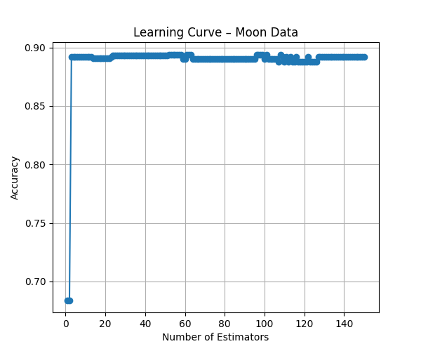

####  Circle Dataset  
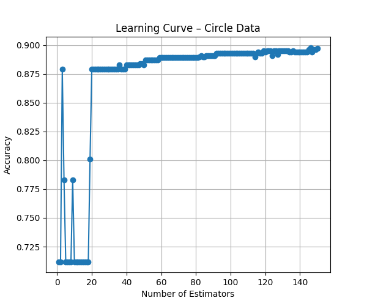

---

### Summary of Visualization Types

| Visualization Type         | Description                                                               |
|----------------------------|---------------------------------------------------------------------------|
| **Decision Boundary**      | Visual representation of classification regions in 2D feature space       |
| **Confusion Matrix**       | Heatmap showing classification accuracy and types of errors                |
| **ROC Curve**              | Shows model's ability to separate classes across thresholds                |
| **Probability Histogram**  | Distribution of predicted class probabilities                             |
| **Learning Curve**         | Performance progression across boosting iterations                        |


## Adjustable Parameters

All configurable in `GradientBoostingClassifier`:

- `n_estimators`: Number of boosting rounds
- `learning_rate`: Learning rate (shrinkage)
- `max_depth`: Depth of each weak learner
- `max_features`: Number of features used in each tree
- `normalize`: Whether to normalize input features

---

---

## Basic Usage Example

Here’s how to train and test the Gradient Boosting Classifier on one of the provided datasets:

```python
from BoostingTrees.model.BoostingTrees import GradientBoostingClassifier
import pandas as pd

df = pd.read_csv("BoostingTrees/tests/classification_data.csv")
X = df.drop("label", axis=1).values
y = df["label"].values

model = GradientBoostingClassifier(n_estimators=100, learning_rate=0.1, max_depth=3)
model.fit(X, y)

preds = model.predict(X)

print("Predictions:", preds[:10])

```
## Limitations & Future Work

### Known Limitations

- Manual balancing for imbalanced datasets
- Performance degradation on categorical columns without preprocessing
- Currently only supports binary classification
- ROC curve AUC values were initially incorrect due to misordered coordinates (fixed)

### Possible Improvements

- Implement pruning or tree regularization
- Support for multi-class problems
- Add early stopping and validation split
- Visual tools for analyzing tree paths or feature importance
- Support real-time prediction or model persistence

---

## Q&A

**What does the model you have implemented do and when should it be used?**  
→ This model predicts binary classification outcomes using an ensemble of decision trees optimized via gradient boosting. It is best used on structured tabular data with non-linear decision boundaries and moderate class imbalance.

**How did you test your model to determine if it is working reasonably correctly?**  
→ We validated performance on both synthetic and real datasets, visualized decision boundaries, learning curves, and confusion matrices, and manually computed standard metrics including accuracy, precision, recall, F1 score, and ROC AUC.

**What parameters have you exposed to users of your implementation in order to tune performance?**  
→ Users can configure the number of estimators (`n_estimators`), tree depth (`max_depth`), learning rate (`learning_rate`), number of features (`max_features`), and normalization (`normalize`). Example usage is provided via test scripts.

**Are there specific inputs that your implementation has trouble with? Given more time, could you work around these or is it fundamental?**  
→ Yes. Highly imbalanced datasets like IBM Attrition result in poor recall. This isn't fundamental to boosting but requires techniques like oversampling, cost-sensitive learning, or ensemble balancing. Currently, we manually engineered workarounds.

---

## Team Members

| Name              | A-Number    | Email                        |
|-------------------|-------------|------------------------------|
| Nupur Gudigar     | A20549865   | ngudigar@hawk.iit.edu        |
| Zaigham Shaikh    | A20554429   | zshaikh4@hawk.iit.edu        |
| Nehil Joshi       | A20554381   | njoshi20@hawk.iit.edu        |
| Riddhi Das        | A20582829   | rdas8@hawk.iit.edu           |
